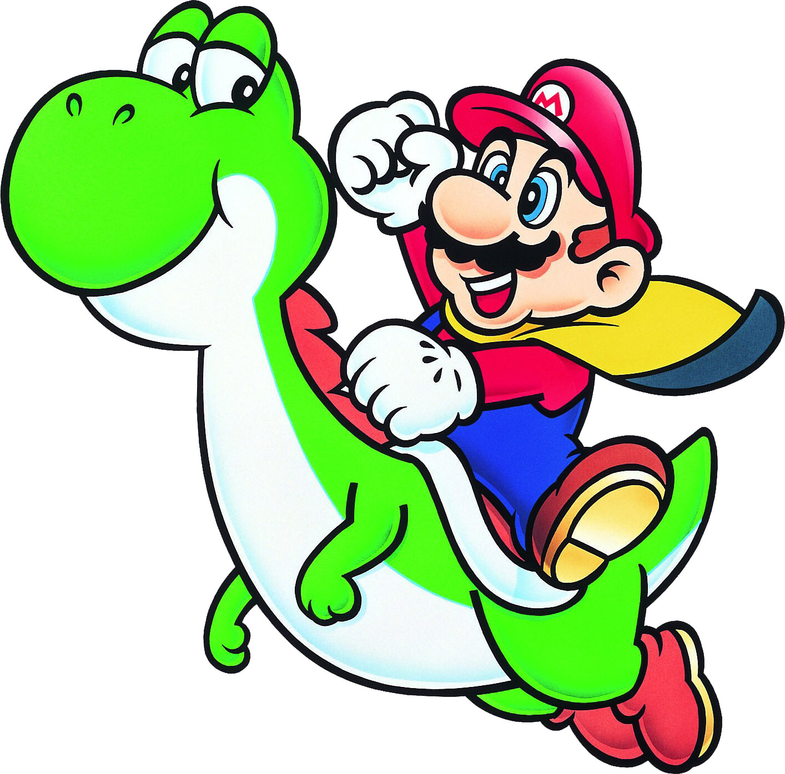

# Play Super Mario with Reinforcement Learning

Play the Super Mario Games starting from the first game that made Mario the superstar he is today using Reinforcement Learning with TensorFlow 2.0 and OpenAI Gym.

YouTube Super Mario RL Playlist
---

Overview
---

The purpose of this project is to build a **Reinforcement Learning** application that can play through Super Mario games. In reinforcement learning, an **agent (mario)** powered by Tensorflow TF-Agents continously learns through trial and error as it interacts with the **environment (super mario levels)**. The environment is powered by OpenAI Gym, specifically gym-super-mario-bros, which is an OpenAI Gym environment for Super Mario Bros on NES. This project involves becoming familiar with reinforcement learning terms: agent, action, environment, rewards and state. The goal is that the application will be able to control mario's movements to finish super mario levels successfully starting with the first game: 1985 Super Mario Bros on NES.

Contents
---

- **[docs/](docs)**: contains documentation on application setup, further reading on articles that are helpful for super mario reinforcement learning and images
- **[super-mario-rl/](super-mario-rl)**: contains application code for super mario reinforcement learning application
- **[environment-gpu.yml](environment-gpu.yml)**: contains anaconda environment installation dependencies and can be used to stup the environment
- **README.md**: contains a project description, how to setup project and how to use the application

Dependencies
---

This project requires the installation of:

- Anaconda on your machine for Python 3.7
  - **Linux**: https://www.anaconda.com/distribution/#linux
  - **Mac**: https://www.anaconda.com/distribution/#macos
  - **Windows**: https://www.anaconda.com/distribution/#windows

How to Run Demo
---

First we will setup the Anaconda environment for super mario since it installs packages, such as TensorFlow 2.0 and OpenAI Gym Interface for Super Mario Bros needed for doing reinforcement learning. After the environment is setup, we will learn to control mario using Python gym-super-mario-bros library. Once we are familiar with the gym environment, we will dive into developing a reinforcement learning application using TF-Agents that can control mario to play the game.

### Setup Super Mario Anaconda Environment

Open your terminal, clone a copy of this repository:

~~~bash
git clone https://github.com/james94/Super-Mario-Reinforcement-Learning
cd Super-Mario-Reinforcement-Learning
~~~

Create a **super-mario-rl** conda environment provisioned with all libraries to run this program:

~~~bash
conda env create -f environment-gpu.yml
~~~

> **Note**: if you don't have access to a gpu, then run `environment.yml`

Activate the **super-mario-rl** environment:

~~~bash
conda activate super-mario-r1
~~~

For other useful conda commands, refer to [setup reference](docs/setup/reference.md).

I need to add my conda environment to PYTHONPATH and then add PYTHONPATH to jupyter environment:

~~~bash
# Update PYTHONPATH with folder paths to modules used in inference notebook
export PYTHONPATH="${PYTHONPATH}:/home/james/miniconda3/envs/cmpe260_dev"

# Update jupyter kernel list's PYTHONPATH
# Get location of kernel.json
jupyter kernelspec list

# Open kernel.json in code
vim /opt/conda/share/jupyter/kernels/python3/kernel.json

# In kernel.json after "language", Add an "env": element consisting of environment variables you wish to include in this kernel's environment
"env": {
    "PYTHONPATH": "${PYTHONPATH}:/home/james/miniconda3/envs/cmpe260_dev"
}
~~~

Code Style
---

Referenced [Google's Python Style Guide](https://google.github.io/styleguide/pyguide.html)